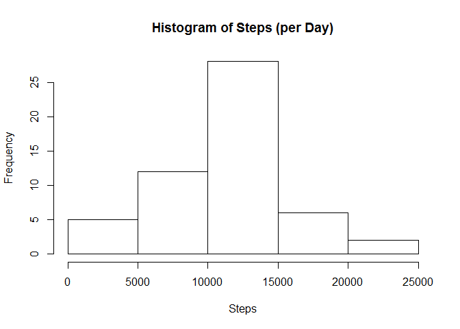
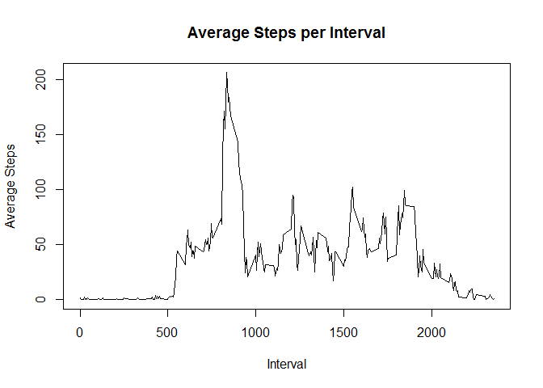
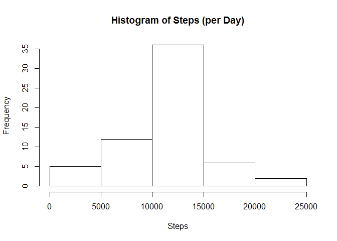
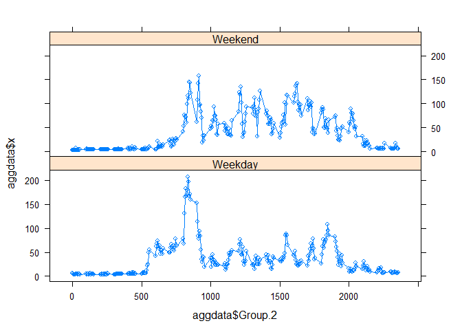

Reading & Preprocessing the Data
--------------------------------

To begin the analysis, I set my working directory and read the data in
using the 'read.csv' function. I then convert the date column to a
POSIXCT format to allow easier analysis later on.

    setwd("C:/Users/william.kemp/Desktop/Data Science - John Hopkins/5. Reproducible Research/Week 2 Peer Review/Data")
    activity <- read.csv("activity.csv")
    activity$date <- as.Date(activity$date,format ="%Y-%m-%d")

What is mean total number of steps taken per day?
-------------------------------------------------

Firstly, I will remove the missing values from this dataset. Then I
aggregate the number of steps taken per day using.

Using this new aggregated data I can calculate the mean number steps
taken per day to be:

    activity2 <-  activity[is.na(activity$steps) == FALSE,]
    aggdata <- aggregate(activity2$steps, by = list(activity2$date),FUN = sum)

Histogram of the number of steps per day:

    hist(aggdata$x,freq=T, main = "Histogram of Steps (per Day)", xlab = "Steps")

The mean and median steps per day:

    mean(aggdata$x,na.rm =T)

    ## [1] 10766.19

    median(aggdata$x, na.rm=T)

    ## [1] 10765

What is the average daily activity pattern?
-------------------------------------------

Aggregating the dataset (with NAs removed) by the time interval I plot a
timeseries of the average number of steps taken per 5 minute interval

    aggdata <- aggregate(activity2$steps, by=list(activity2$interval),FUN = mean)
    plot(aggdata$Group.1,aggdata$x,type = "l",xlab ="Interval",ylab="Average Steps", main = "Average Steps per Interval")

The interval containing the max. number of steps is:

    subset(aggdata,max(aggdata$x)==x)$Group.1

    ## [1] 835

Imputing missing values
-----------------------

The total number of missing values from the original dataset are:

    sum(is.na(activity))

    ## [1] 2304

To complete these missing values I will use a linear regression model to
estimate the missing data:

    model <- lm(steps~date + interval, data = activity)
    activity <- within(activity,steps <- ifelse(is.na(steps),as.integer(predict(model,activity[,c(2,3)])),steps))
    aggdata <- aggregate(activity$steps, by = list(activity$date),FUN = sum)

I then aggregate the data by day as before, and create a histogram of
the steps taken, with the new completed dataset:

    aggdata <- aggregate(activity$steps, by = list(activity$date),FUN = sum)
    hist(aggdata$x,freq=T, main = "Histogram of Steps (per Day)", xlab = "Steps")

The mean and median of the new dataset are as follows:

    mean(aggdata$x,na.rm =T)

    ## [1] 10748.03

    median(aggdata$x, na.rm=T)

    ## [1] 10652

Imputing the missing data using a linear model has had the impact of
slightly reducing both the mean and median of the data.

Are there differences in activity patterns between weekdays and weekends?
-------------------------------------------------------------------------

Firstly, I create a new factor variable using the weekdays() function. I
then change these to the labels 'Weekend' and Weekday:

    activity$weekday <- weekdays(activity$date)
    activity$weekday[!(activity$weekday %in% c("Saturday","Sunday"))] <- "Weekday"
    activity$weekday[activity$weekday %in% c("Saturday","Sunday")] <- "Weekend"
    activity$weekday <- as.factor(activity$weekday)

I then aggregate the number of steps by the newly created factor
variable. Finally, I plot a lattice time series graph to show the
difference in evolution of steps per 5 minute interval

    require(lattice)

    ## Loading required package: lattice

    aggdata <- aggregate(activity$steps, by=list(activity$weekday,activity$interval),FUN = mean)
    xyplot(aggdata$x~aggdata$Group.2|as.factor(aggdata$Group.1),type="b",layout =c(1,2))

